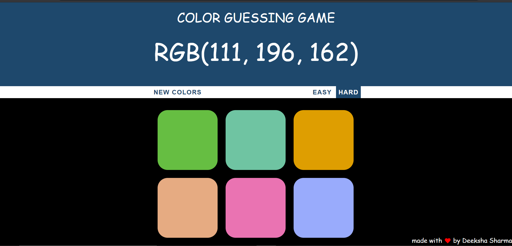
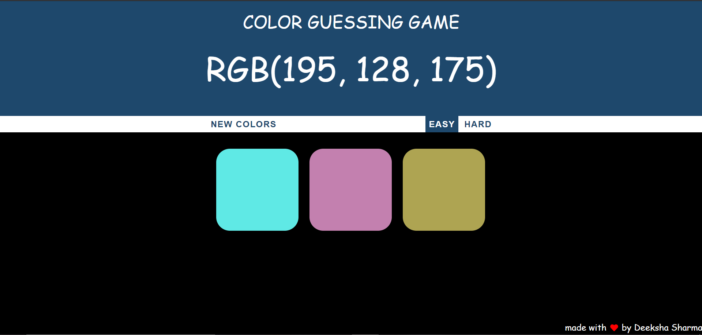
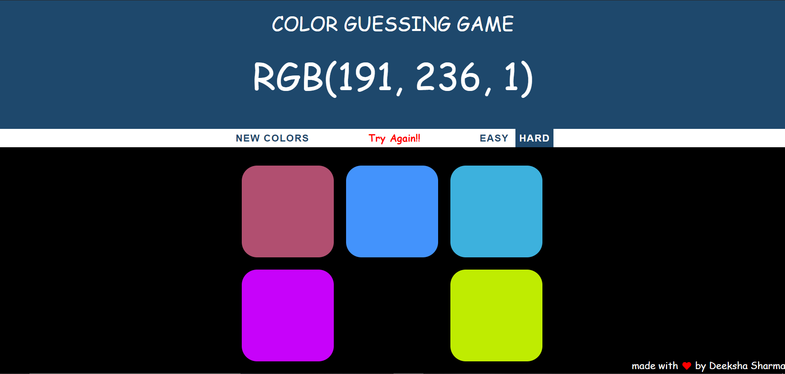
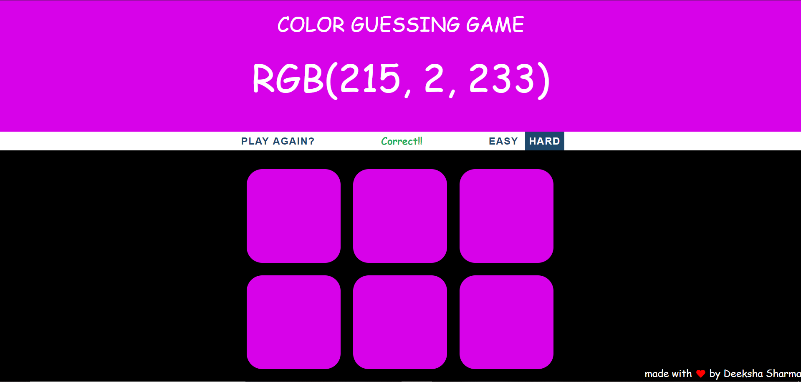

## RGB-color-game
[Fun Game](https://deeksha2501.github.io/RGB-color-game/) using basic JAVASCRIPT , HTML and CSS. 

## Features of the game
  You can switch between easy and difficult mode. 
  You can reset the game to the new set of colors.

## Screenshots of the project

   
  ### Switching to Easy mode 
   
  ### Wrong Guess
   
  ### If choosen the correct color box(matches with the the given RGB code).
  
